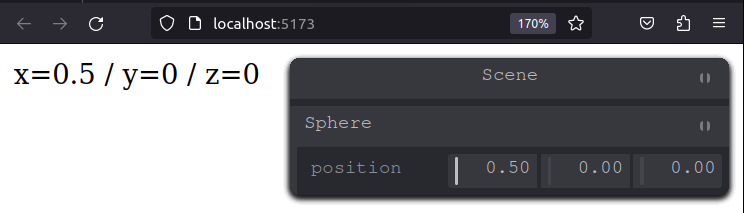

## Create svelte test application and install tweakpane

npm create svelte@latest tweakpane_test 
cd tweakpane_test  
npm i tweakpane  
npm i @tweakpane/core

## Example

Edit +page.svelte, and replace code with:

```svelte
<script>
	import { browser } from '$app/environment';
	import { Pane } from 'tweakpane';

	const sphere = {
		position: { x: 0, y: 0, z: 0 }
	};
	if (browser) {
		const pane = new Pane({ title: 'Scene' });
		const sphereControls = pane.addFolder({ title: 'Sphere' });
		sphereControls.addBinding(sphere, 'position');
		sphereControls.on('change', onSpherePositionUpdate);
	}

	function onSpherePositionUpdate({ value }) {
		sphere.position = value;
	}
</script>

x={sphere.position.x} / y={sphere.position.y} / z={sphere.position.z}
```


